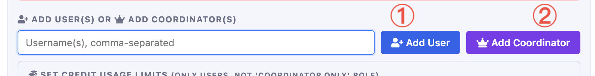
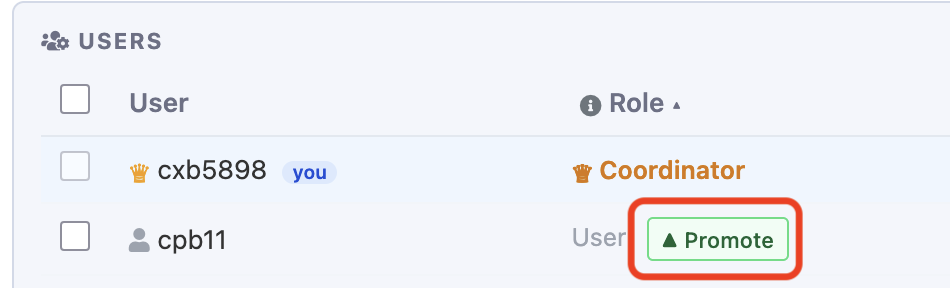
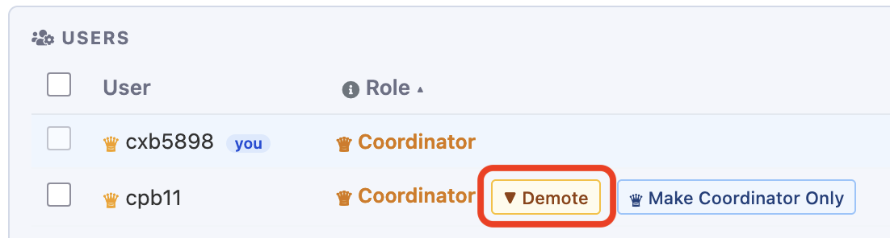
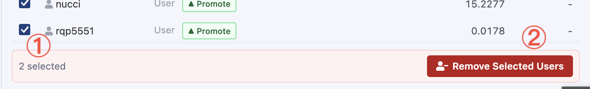
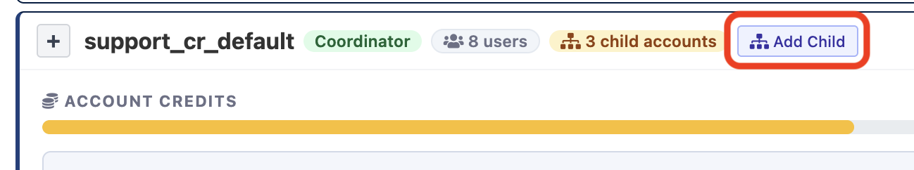
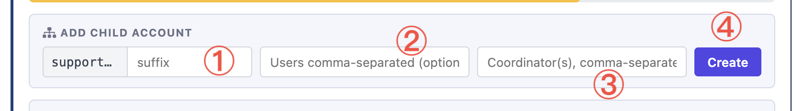
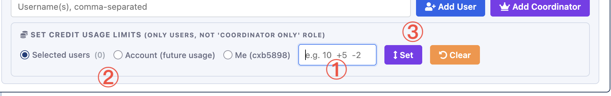
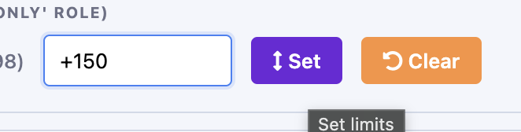

# Managing compute

There are several self-service options for managing an ICDS paid compute account, including 
adding and removing users or coordinators, creating child accounts, and setting credit usage 
limits.

## Account roles

Individuals can be added to compute accounts with two different roles - users and coordinators. 
These roles are mutually exclusive - coordinators do not need to be users.

| Role             | Permissions                                                                                               |
|------------------|-----------------------------------------------------------------------------------------------------------|
| User             | Can use the account resources for running jobs                                                            |
| Coordinator Only | Can add and remove users and coordinators from the account                                                |
| Coordinator      | Can use the account resources for running jobs<br>Can add and remove users and coordinators from the account |

When a new compute account is created, the account owner is automatically added and granted 
coordinator access. As coordinator, they can add and remove other users and coordinators. 


## Reserved allocations

Reserve allocations can use [the `my_account` utility](#my_account-cli) in a shell session 
either through [the Portal](../running-jobs/portal.md/#command-line-access) or an 
[SSH connection](../getting-started/connecting.md/#ssh) to add and remove users or coordinators.

## Credit accounts

To manage credit accounts, coordinators can either use the graphical 
[Slurm Account Manager](#slurm-account-manager) found on the [Portal](../running-jobs/portal.md) 
or the [command line utility `my_account`](#my_account-cli).


### my_account CLI

#### Manage users and coordinators

Account coordinators can add users and coordinators using `my_account add`. Use the arguments 
`user=` and `coordinator=` to indicate the role you wish to assign

```
my_account add account=<child_crch_account> user=<userid> coordinator=<userid>
```

To remove users, `my_account remove` can be used

```
my_account remove account=<child_crch_account> user=<userid> coordinator=<userid>
```

!!! note Inherited coordinators cannot be removed from child accounts.
    Child accounts automatically inherit all of the coordinators from the parent account. 
    These inherited coordinators cannot be removed while they remain coordinators of the 
    parent account.


#### Create and manage child accounts

**Credit accounts** can serve as parents to one or more child accounts, allowing the balance 
credits in the parent account to be shared with the child accounts.

Child account names take the form of `<prefix>_crch_<suffix>` where the prefix is set to that 
of the parent account. Child accounts can have custom suffixes but must inherit the prefix 
of the parent account.

For example, for a parent account named `research_cr_default`, the child account 
`research_crch_professor1` is valid where `research2_crch_default` is not.

Child accounts can be created using `my_account create`.

```
my_account create account=<child_crch_account> parent=<parent_cr_account>
```

Users and coordinators can be added at the same time the child account is created, by also 
including the `user` and `coordinator` arguments.

```
my_account create account=<child_crch_account> parent=<parent_cr_account> user=<userid> 
coordinator=<coordid>
```

#### Setting usage limits

The available balance of credits can be set for individual users or child accounts. These 
limits are completely independent of the total credits available in the account.

!!! warning "It is possible to over-allocate credits"
    Available credit limits just limit how many credits can be used by an individual 
    user or account. They are not bound by the available credits, and it is possible to 
    allow more available credits than is actually in the parent account.

To set limits, `my_account set` is used with the `available=` argument to set the current 
level of available credits for the entire account. Please note account limits can only be set 
on accounts by coordinators of the parent account.


```
my_account set available=n account=<child_crch_account>
```

where n is the desired available balance in the child account.

To set limits for specific users, the `user=` argument is used. When a single ID or a list 
of comma-separated IDs is passed, the limit will be set for all of the specified users.

```
my_account set available=n account=<child_crch_account> user=<userid>
```

Using `user=all` will set the individual limit for all users in the account.

```
my_account set available=n account=<child_crch_account> user=all
```

`my_account set` will also accept relative available limit changes using the +n or -n 
notation. For example, adding 50 credits to all account users' available limit would use 
this command.

```
my_account set available=+50 account=<child_crch_account> available=+50 users=all

```

### Slurm Account Manager

To access the Slurm Account Manager, connect to the Portal and then select "Account Manager" 
from the "Clusters" menu.

#### Manage users and coordinators

##### Adding users or coordinators

To add users or coordinators, locate the account in the list and click the [+] to expand the details.

Under "Add Users(s) or Add coordinators", enter the Penn State Access ID in the text box(1) and click 
"Add User"(2) or "Add Coordinator"(3) as desired. 



!!! tip "Add multiple people at once."
    The form will accept a list of comma-separated IDs, allowing you to enter several people
    in a single step.
    
##### Grant coordinator access

To change permissions of an existing individual, you can click the buttons next to their 
entry in the list of Users. To grant a user the role of Coordinator, click "Promote".



Alternately, to remove Coordinator permissions but continue to allow access as a user, click "Demote"(1).
Clicking "Make Coordinator Only"(2) removes only user permissions while maintaining access as a Coordinator.



##### Removing users and coordinators

To remove all access, select users to remove by clicking the checkbox next to their ID(1) and 
clicking the "Remove Selected Users" button(2).



!!! note "Inherited coordinators cannot be removed from child accounts.""
    Child accounts automatically inherit all of the coordinators from the parent account. 
    These inherited coordinators cannot be removed while they remain coordinators of the 
    parent account.


#### Create child accounts

Credit accounts can serve as parents to one or more child accounts, allowing the credits 
in the parent account to be shared with the child accounts.

Child account names take the form of `<prefix>_crch_<suffix>` where the prefix is set to that 
of the parent account. Child accounts can have custom suffixes but must inherit the prefix 
of the parent account. For example, for a parent account named `research_cr_default`, the child account 
`research_crch_professor1` is valid where `research2_crch_default` is not.

To create a child account, click the "Add Child" button located next to the top of the 
account detail box.



Enter the desired suffix in the text box(1) and if desired, the Penn State Access ID for 
any users(2) and coordinators(3) to be added to the child account. Then click "Create"(4).



Once the child account is created, 
[additional users and coordinators can be added](#manage-users-and-coordinators) and 
[credit usage limits](#setting-usage-limits) can be set as well.

#### Setting available balance

The available balance of credits can be set for individual users or child accounts. These 
limits are completely independent of the total credits available in the account.

!!! warning "It is possible to over-allocate credits"
    Available credit limits just limit how many credits can be used by an individual 
    user or account. They are not bound by the available credits, and it is possible to 
    allow more available credits than is actually in the parent account.


Available credit balances can be set using the "Set Credit Usage Limits" box. Enter the 
desired credit amount in the box(1) and select how you want the limit applied. For individual 
user limits, click the checkbox before each target user and choose the "Selected users"(2) 
option.

For account level limits, choose "Account"(2). Please note account limits can only be set 
on accounts by coordinators of the parent account. Then click "Set"(3) to activate.



Available limits can also be set relative to current levels using a +n or -n entry. For example, 
to set the available limit 100 credits higher than the current limit, +100 can be entered 
in the limit field.




## Monitoring available balance

`get_balance` displays current balances for credit accounts and allocations. <br>
For help, use `get_balance --help`.

!!! warning "Request only the hardware you need."
	Jobs paid by credit accounts are charged 
	for requested hardware, whether or not it is used.
