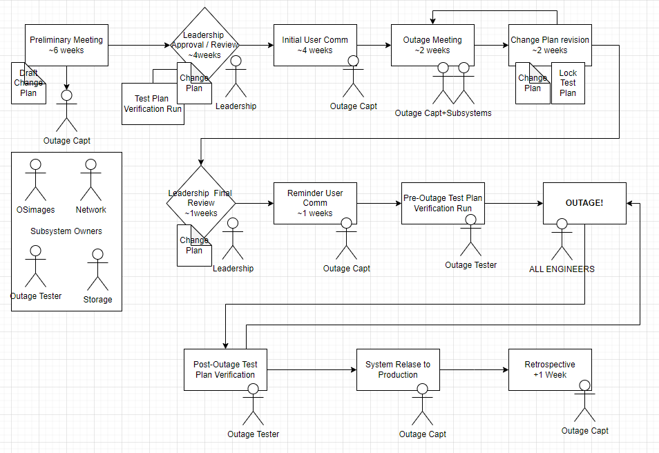

# ICDS Roar System Outages

ICDS engineers have updateed and expanded the outage protocol to improve recovery time and expand testing. 

The outage workflow has been updated to make use of serviceNOW and provide tracking: 
    - changes are throughly documented
    - includes a review by leadership to understand potential impacts
    - system test plan that includes client-submitted use cases

## Planned Outage 2025-05-14

### Outage Duration
    - Planned May 14, 2025 17:00 -- May 15, 2025 17:00
    - Actual …

### Plan of Actions
    -	STORAGE: troubleshoot power redundancy configuration on RC group storage
    -	STORAGE: continue to troubleshoot RDMA timeout issues on RC group storage 
    -	STORAGE: Globus software update from 5.4.80 to 5.4.85. 
    -	NETWORK: resolve hardware error on Interconnect Switch
    -	SCHEDULER: - Slurm Update from 24.05.4 to 24.05.8
    -	Operating System Image and Package updates
    -	tenative package list: [image_pkg_update_list_20250416.txt] (../img/image_pkg_update_list_20250416.txt)
    -	final package list (TBD)
    -	Workflow: update symlink at /storage/icds/tools/sw/firefox to point to updated firefox.
    -	Cluster Admin Node Updates
    -	Re-sync the software stack between RC and RR
    -	License Updates: MATLAB, COMSOL, Mathematica

### ServiceNow Links
ServiceNow Form
    - RITM0362423 [RITM0362423](https://pennstate.service-now.com/nav_to.do?uri=sc_req_item.do%3Fsys_id=9dc5c7af47302e94fb179df4126d439c%26sysparm_stack=sc_req_item_list.do%3Fsysparm_query=active=true)

    - CHG0121515 [CHG0121515](https://pennstate.service-now.com/nav_to.do?uri=change_request.do%3Fsys_id=39c50baf47302e94fb179df4126d436f%26sysparm_stack=change_request_list.do%3Fsysparm_query=active=true)
