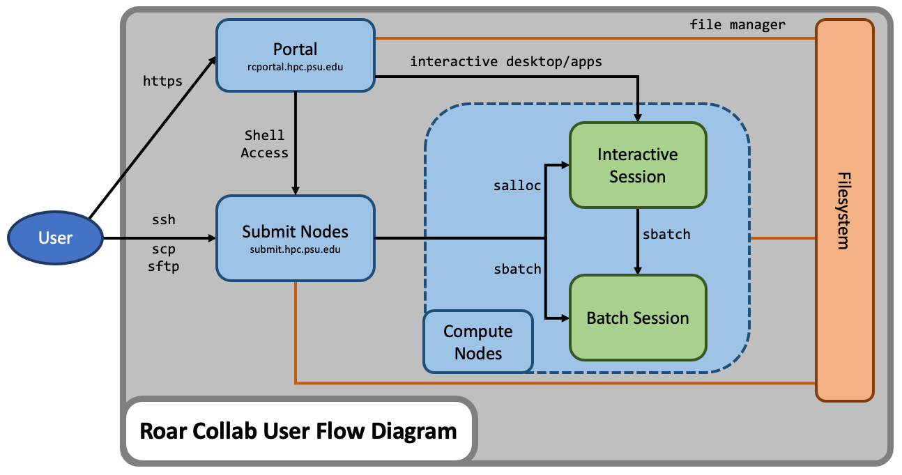

# System Overview

Compute clusters like Roar serve many purposes:

- **number crunching**, much bigger and faster than a laptop
- **batch compute jobs**, submitted and performed later
- **interactive computing**, on the equivalent of a powerful workstation
- **large-scale storage** and access of data files

Roar consists of two clusters:  **Roar Collab**, and **Roar Restricted**.
Roar Collab is for general use;
Roar Restricted is only for users working with sensitive data requiring extra security provisions.  
For details, see the [Roar Restricted](../roar-restricted/rr-getting-started.md) addendum.

## Architecture

Collab consists of different parts, connected together by networks:

- **users** of the cluster, who connect to either
- **submit nodes**, to prepare and submit jobs, or
- **the Portal**, for interactive computing;
- **file storage** for user files, plus
- **scratch storage** for temporary files; and 
- **compute nodes**, of several different types.

## Compute Hardware

A cluster consists of multiple nodes connected to one or more central filesystems. 
A node is basically a single computer, roughly comparable to a powerful desktop machine. 

Some nodes are networked together with fast connections (Infiniband) that enable 
efficient communication between nodes, allowing large jobs to run in parallel 
on multiple nodes.

Finally, some nodes include GPUs (graphical processing units),
which can accelerate certain compute jobs.

### Available Hardware on RC

### Available Hardware on RR
