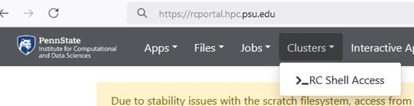

# Using modules

The Roar software environment is split into two parts: **preloaded
software** (available immediately upon login) and **modular software**
(which must be explicitly loaded).

To manage conflicts that arise from different applications requiring
different versions of libraries, Roar uses the [Lmod Environment Module
System](https://lmod.readthedocs.io/en/latest/).

## Finding software

!!! note "Check for existing software"
	Before using a module, check if the software is already
	available or if it needs to be loaded.

### Check for preloaded applications

Use the `which` command. If the application is on your `$PATH`, `which`
will return the full path to the executable.

``` bash
which <appName>
```

### Search available modules

If `which` doesn't find the application, use `module spider` to search
all available modules, including those that are currently hidden due to
environment constraints.

``` bash
module spider <moduleName>
```

### Software list on portal

Once logged into the [Portal](../running-jobs/portal.md), a searchable list 
of available software can be found by selecting the "Available Modules" 
from the "Clusters" menu.



## Module commands

These commands are the core of interacting with **Lmod**.

| Command | Action | Example |
|----------|---------|----------|
| `module avail` | Lists all modules immediately available to load based on your current environment. | `module avail` |
| `module spider <name>` | Searches for *all* modules, even those currently hidden. Use this to find a module's name or version. | `module spider R` |
| `module load <name>` | Loads the default version of the module. | `module load python` |
| `module load <name>/<version>` | Loads a specific version of the software. Always specify versions in production scripts! | `module load python/3.10.4` |
| `module unload <name>` | Removes the software and its environment settings. | `module unload python` |
| `module list` | Shows all modules currently loaded in your session. | `module list` |
| `module purge` | Unloads all currently loaded modules, returning you to a minimal base environment. | `module purge` |
| `module show <name>` | Displays environment variables, paths, and changes the module file executes upon loading. | `module show hdf5` |


### Identifying default versions

When you run `module avail <name>` or `module spider <name>`, the
default version for a module is often indicated by a special marker
(like `(D)`, `(default)`, or a star `*`).

```
$ module avail python

    python/3.8.12
    python/3.9.7
    python/3.10.4 (D)  <-- This is the default

```

Running `module load python` will load version **3.10.4**.

### Changing default software stack

In January 2026, ICDS implemented a new software stack based on the Spack package manager. 
This may cause changes in the dependent version loaded or implentation of a new instalation 
for existing versions. 

To force usage of the old stack, you can unload the new stack with the command:

```
module unuse /storage/icds/sw8/modulefiles/Core
```


## Advanced module concepts

!!! tip "Compilers and Dependencies"
	Understanding compiler and dependency relationships is
	crucial for stability and reproducibility.

### Compiler and dependency control

Many scientific applications (like MPI, HDF5, or specific libraries) are
compiled against a specific base compiler (e.g., GCC, Intel, AOCC).\
If an application requires `gcc/11.2.0`, you must load that compiler
module first.

When using `module spider`, it will often inform you about dependencies,
guiding you to the correct module sequence.

Here's an example of a compile dependency being loaded before the desired application: 

``` bash
module load gcc/11.2.0      # 1. Load the required compiler
module load openmpi/4.1.3   # 2. Load the application/library built with that compiler
```

### Version control

Always specify the full module name and version (e.g., `hdf5/1.13.1-gcc-11.2.0`).

Loading a module without a version (e.g., `module load hdf5`) loads the
**current default**. The default version can change over time due to system upgrades.

!!! tip "Consistent Module Use"
	Specifying the version ensures your job runs consistently and reproducibly.


## Tips for batch scripts

Batch jobs are highly sensitive to their environment. Follow these best practices to 
ensure reliable execution:

- Use `module purge` first. Start your script with a clean environment to prevent conflicts 
by using the command `module purge`
- Load only what is necessary. Avoid unnecessary modules to reduce conflicts and startup delays.
- Specify full versions. Always use the `<name>/<version>` syntax to help ensure reproducibility, 
such as `module load python/3.9.7` instead of `module load python`


Here's an example of a robust batch script using the tips outlined above:
	
``` bash
#!/bin/bash
#SBATCH --job-name=MyMPIJob
#SBATCH --nodes=4

# 1. Start with a clean slate
module purge

# 2. Load dependencies explicitly
module load gcc/11.2.0
module load openmpi/4.1.3

# 3. Execute the job
srun ./my_parallel_executable
```

!!! warning "Avoid loading modules in `.bashrc`"
	Automatically loading modules in your `~/.bashrc` can cause errors and software conflicts 
	on HPC systems, including inhibiting login altogether. Always be cautious when making 
	modifications to your configuration files.
