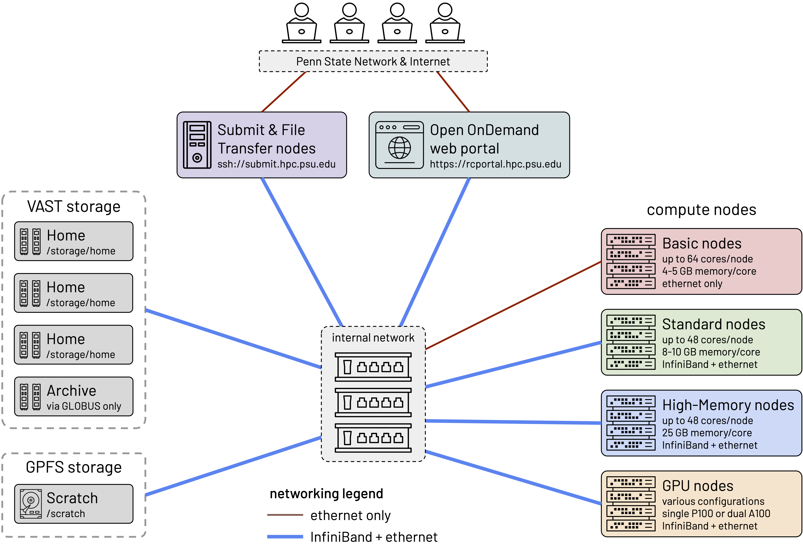

# System overview

Compute clusters like Roar serve many purposes:

- **number crunching**, much bigger and faster than a laptop
- **batch compute jobs**, submitted and performed later
- **interactive computing**, on the equivalent of a powerful workstation
- **large-scale storage** and access of data files

## Architecture

Roar consists of different parts, connected together by networks:

- **users** of the cluster, who connect to either
- **the Portal**, for interactive computing, or
- **submit nodes**, to prepare and submit jobs;
- **file storage** for user files, plus
- **scratch storage** for temporary files; and 
- **compute nodes**, of several different types.



Additional information on the Roar Collab system configuration can be found in 
[Compute Hardware](compute-hardware.md)

## Accounts

To log on to Roar, you need a [login account](../getting-started/connecting.md/#roar-account-creation).
To work on Roar, you can use the open queue at no cost,
which gives you access to the Portal, 
and to batch jobs on vintage hardware.

But to use any of the newer, more powerful hardware, 
you need either a paid [credit account](../accounts/paid-resources.md), 
or a paid [allocation](../accounts/paid-resources.md).
With credit accounts, you pay only only the compute resources you use,
and can use any type of nodes you need.
However, if you require prompt access to specific hardware,
you can opt for an allocation ---
in which you reserve specific hardware,
and pay whether or not you use the compute time.

## Partitions

In Slurm, what are commonly called "queues" are technically known as Partitions. A 
partition is a logical grouping of compute nodes (servers) that your job can run on. 

Nodes on Roar are grouped into four different hardware partitions:

- **basic** – CPU nodes without Infiniband, for jobs that fit on a single node.
- **standard** – CPU nodes with Infiniband (essential for multinode jobs).
- **himem** – CPU nodes with extra memory, for memory-intensive jobs.
- **interactive** – Nodes with graphics cards, that service the Portal.

All the various types of GPU nodes are grouped into the standard partition,
except the P100 GPU nodes that service the interactive partition.

In addition, there is a partition not associated with specific hardware:

- **sla-prio** - For paid allocations, with whatever hardware the allocation includes.

You must specify a partition to tell Slurm where your job should run. This is done with 
the #SBATCH directive:

```bash
#SBATCH --partition=<partition_name>
```

To see a list of all available partitions and their status, you can use the sinfo command - 

```bash
sinfo --Format=features:40,nodelist:20,cpus:10,memory:10,partition
```

!!!warning "Bypass queue for Credit Allocations" 
	For Credit allocations, to bypass the wait time
	for your job. You can specify ``--qos=express``. This will place your job into our priority queue
	 at an increased cost (2x that of normal credit jobs)

## Quality of Service (QOS)

While a partition is where your job runs, Quality of Service (QOS) is how your job is 
treated. On Roar, most QOS settings are applied automatically based on the partition you 
choose. For example, submitting to the open partition automatically assigns the open QOS.

Roar has five QoS :  open, normal, debug, express, and interactive.  
Each serves a different purpose, and has different restrictions.

| QOS | description | restrictions |
| ---- | ---- | ---- |
| normal | for "normal" jobs | runtime < 14 days |
| debug	| for testing, debugging, and code compilation | one job per user <br> runtime < 4 hours |
| express | for rush jobs; <br> **charges 2x price** | runtime < 14 days |
| interactive | for Portal jobs requiring graphical support | one job per user <br> 4 core and 64 GB max <br> runtime < 48 hours |

To get detailed information about QoS, use `sacctmgr list qos`.  
This command has a lot of [options](https://slurm.schedmd.com/sacctmgr.html),
and works best with formatting:  an example is
```
sacctmgr list qos format=name%8,maxjobs%8,maxsubmitjobsperuser%9,maxwall%8,\
priority%8,preempt%8,usagefactor%12 names=open,ic,debug,express,normal
```
which produces output like this:
```
    Name  MaxJobs MaxSubmit  MaxWall Priority  Preempt  UsageFactor
-------- -------- --------- -------- -------- -------- ------------
  normal                                 1000     open     1.000000
      ic        1                           0              1.000000
   debug        1         1 04:00:00    20000     open     1.000000
 express                                10000     open     2.000000
```